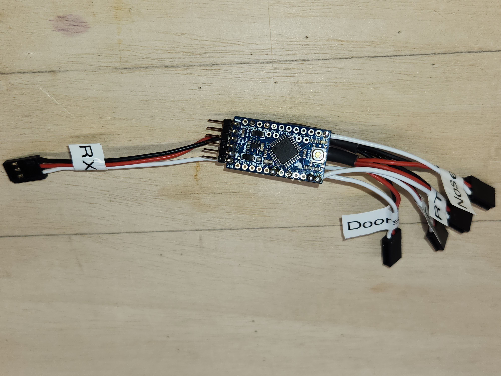

# Landing Gear Sequencer

## Change Log
| Version | Description |
| v1.0    | Basic support for operating 3 gear and doors.  Doors operate simultaneously, but gears are staged so that each gear actuation starts up independently (avoid a large current spike which can fool the gears over-current protection).
| v1.1.   | Added support for landing light operation from the Arduino.

## Background
I acquired an e-Flite F-16 80mm and in the course of setting up and bench testing everything I found 
that the landing gear was unreliable.  Rarely would all 3 units actuate.  Most of the time only 2 units 
would actuate with the right main gear being the most common failure.  Testing individually, all units 
worked reliably.  Research indicated that given all gears worked individually, but failed when actuated 
together, that the most likely cause was over-current protection preventing the gear from actuating because
it perceived that the motor might be stalled and this prevents the motor from burning out. Since the gear 
operate reliably independently, the idea is to separate the startup current surges so that they don't occur
simultaneously.  So far, it appears that this strategy does in deed work.

Since some users report that the retracts in their models operate reliably, even when actuating simultaneously,
I am assuming that there might be manufacturing tolerances in the over-current circuits that make some units
more suceptable to this failure mode.  It is also possible that variations in landing gear mechanism and 
motors also contribute to differences from specific model to model.  In any case, even if the gear operates
reliably, using this sequential startup of each gear should only make it more reliable at a small cost in 
cycle time.

## Design Goals
- Small reliable microcontroller that can handle the timing requirements.
- 5v pins to minimize the integration requirements with the 6v BEC in the e-Flite F-16.
- At startup do not command the gear to do anything. Once an input signal is detected, wait fot the first
  transition, and then command the gear to move to the requested position.
- Implement in a way that makes it relatively easy to modify output signal pulse widths 
  (position/endpoint adjustments) and thresholds (gear up / gear down triggers)

## Design Requirements
- Reads one incoming 50 Hz servo control pulse, gear channel from radio.
- Commands triggered with separate thresholds (creating a deadband):
  - Raise command when pulse width is below lower threshold.
  - Lower command when pulse width is above upper threshold.
  - Commands "hold" between "triggers".
- Drives four servo outputs (door, left main, right main, nose) with staged delays.
- Supports configurable slew rates for each output channel.
- At startup, initializes all servo targets to doors open and gear down, but does NOT generate output pulses.
- Only begins generating pulses on the first valid command transition.
- Allow reversing mid-sequence, the new command takes effect when detected.

## Pin Assignments
- Input pulse capture: D8 (PB0 / ICP1)
- Door servo output: D3 (PD3)
- Left main gear servo output: D5 (PD5)
- Right main gear servo output: D9 (PB1)
- Nose gear servo output: D10 (PB2)
- Landing Lights output: D4 (PD4) (5v, load up to 30ma, on while gear is down)
- Keep D0/D1 reserved for bootloader and serial monitoring
- D13 optional status LED

## Control Sequences
Sequence delays are based on transition start times and do not include/extend for servo slew time.

### Lower Gear Sequence
1. Door -> Start to open at t=0 ms
1. Delay 1200 ms
1. Left Main -> Start down at t=1200 ms
1. Delay 1000 ms
1. Right Main -> Start down at t=2200 ms
1. Delay 1000 ms
1. Nose -> Start down down at t=3200 ms
1. Delay 2800 ms
1. Landing Lights -> Come on at t=6000 ms

### Raise Gear Sequence
1. Left Main -> Starts up at t=0 ms
1. Delay 10 ms
1. Landing Lights -> Turn off at t=10 ms
1. Delay 990 ms
1. Right Main -> Starts up at t=1000 ms
1. Delay 1000 ms
1. Nose -> Starts up at t=2000 ms
1. Delay 5000 ms
1. Door -> Start closing at t=7000 ms

## Architecture
- Interrupt-based pulse measurement for input capture.
- Non-blocking scheduler for output sequencing (no delay calls in main logic).
- Servo output layer with per-channel pulse-width targets.
- Configurable per-channel slew-rate limiting layer between target updates and output pulses.
- State machine for command decoding and sequence execution.
- Output pulse generation gated by command validity (no pulses until first valid command transition).

## Construction

### Code
Code is native AVR C and is in a single file, `sequencer.c` 

#### Toolchain
The only toolchain needed to build this project are avr-gcc to compile the code and avrdude to flash it to your target.

#### Building
Building is done using a typical `Makefile`.
Executing `make` will generate the sequencer.hex file in the root of the project. 

#### Flashing
Once you have built the code, you can upload the code to your target board using `make upload`.  Since your environment will differ from mine, you'll
need to modify the Makefile so that it can find the correct serial port.  At the top of `Makefile` you'll find a configuration like:

`PORT = /dev/cu.usbserial-AD02668J`

If you're on a linux like system try executing `ls -l /dev/usb*` - most of the time there will only be one result and you can replace `/dev/cu.usbserial-AD02668J` with the output from your system.  If you're on Windows you can use Device Manager is see which COM port appears / disappears when you plug in / unplug the FTDI device.

Once you have made this change, you should be able to just use `make upload` from then on.

### Hardware
I have used the Arduino Pro Mini, but you could probably adapt the design to run on a different ATmega 328P device fairly easily, or if you adapt the code to a different architecture.

### Assembly

#### Materials
- [Sparkfun Arduino Pro Mini](https://www.sparkfun.com/arduino-pro-mini-328-5v-16mhz.html)
- [Optional] [FTDI Breakout 5V](https://www.sparkfun.com/sparkfun-ftdi-basic-breakout-5v.html) If you regularly work on microcontroller projects you might already have one of these or some other method to flash your code onto the Arduino.  If not, this is probably the easist, fastest way to fill this need.
- Servo leads for the RX input and the 4 outputs (I'm using a terminal block to connect the outputs, so I used all female connectors, but you could also use a female connector for the input and male connectors for the 4 outputs)
- An IN4001 diode to drop the 6V BEC voltage down to ~5.3V
- A 100 ohm 1/4 watt resistor to limit the current for the landing lights.
- Heat shrink tubing in various sizes or insulated crimp connectors
- [Optional] Small cable wraps
- Solder and flux
- Labels (either a label maker or pre-made labels)
- [Optional] A 6 position Dupont connector housing and 2 female terminals. (This can be used as a protective cover for the programming header when installed in an aircraft)

#### Steps
1. For the servo leads you can either build your own or buy pre-made leads. You will need a 2 position male connector for the landing lights.
1. Prepare the power bus by tying all the ground and power lines together using either solder/heatshrink or crimp connectors. Do NOT tie the positive lead for the landing lights to the power bus, it will go to D4.  Be sure to include extra pigtails for tying the power and ground to the Arduino.
1. Solder the cathode of the diode (side marked with the band) to the Vcc pin
of the Arduino.
1. Solder the signal from the input (RX) to pin D8 on the Arduino.
1. Solder the output signals to pins D3, D5, D9, and D10 on the Arduino and mark the connectors appropriately.
1. Solder the landing lights power lead to D4 placing the 100Ω resistor either in the power lead or between the D4 pin and the lead.
1. Solder the positive pigtail to the anode of the diode.
1. Solder the negative pigtail to the ground pin on the Arduino.
1. Shrink wrap or cable tie the wiring to keep everying neat and tidy.
1. [Optional] Create a protective cover for the programming header from a 6 position housing and 2 spare female terminals.

Completed sequencer (landing lights connector not shown)

Close-up of the voltage drop diode to bring the 6V BEC output down below the Arduino 5.5V max input

Simple cover to guard the programming header while in the plane

## Support
If you find this project useful and you want to support my work, please consider [buying me a cup of coffee](buymeacoffee.com/sceaj).  Thank you.